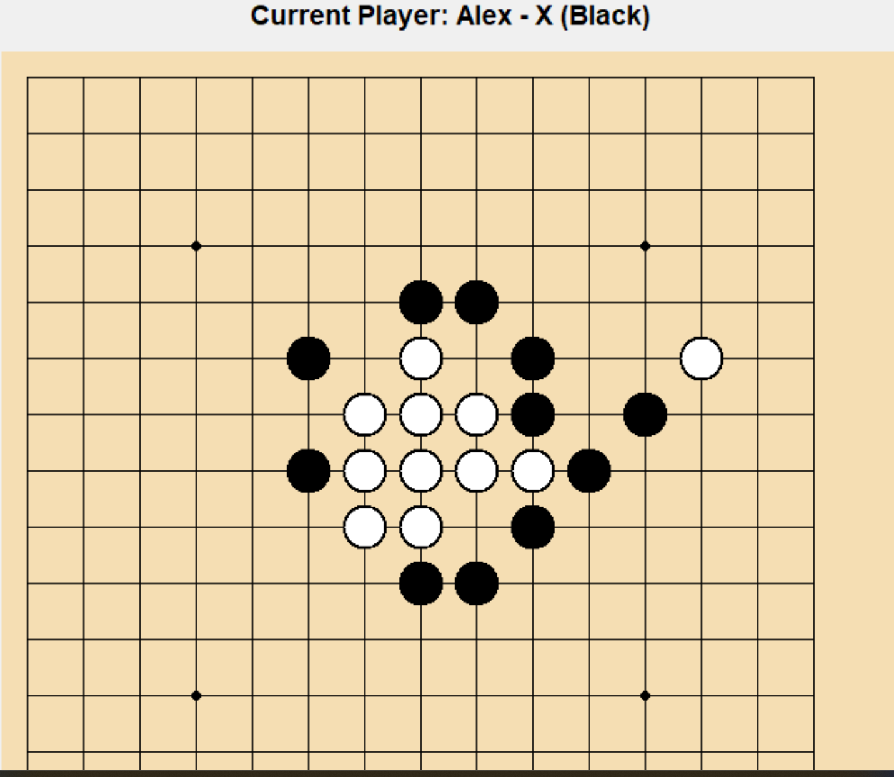

# Gomoku AI

A GUI-based implementation of Gomoku featuring a minimax-powered AI opponent with adjustable difficulty levels.

<p align="center">
  
</p>

## Overview

This project implements the classic Gomoku (Five in a Row) board game with:

- Human vs Human mode
- Human vs AI mode
- AI opponent using the Minimax algorithm
- Adjustable search depth (difficulty levels)
- Graphical interface built in Python

The focus of the project is algorithmic decision-making and clean game-state modeling.

---

## Architecture

The system is structured into:

- **Board logic** — game state representation and rule validation
- **AI engine** — Minimax implementation with evaluation heuristic
- **Game controller** — manages turn order and win detection
- **GUI layer** — handles rendering and user interaction

The AI evaluates board states using a scoring heuristic and selects optimal moves based on depth-limited search.

---

## Minimax Implementation

The AI:

- Explores possible future board states
- Uses recursive depth-limited search
- Evaluates leaf states using a custom heuristic
- Selects moves maximizing its advantage while minimizing opponent advantage

Difficulty levels adjust search depth to balance performance and strength.

---

## How to Run

```bash
pip install -r requirements.txt
python src/main.py
